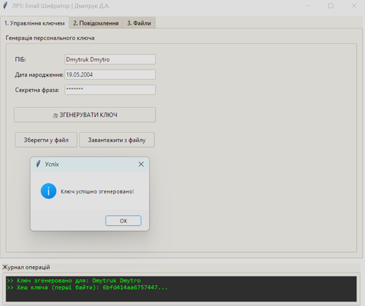
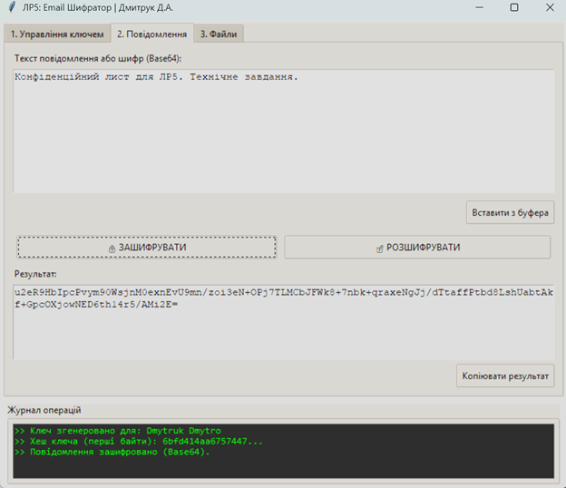
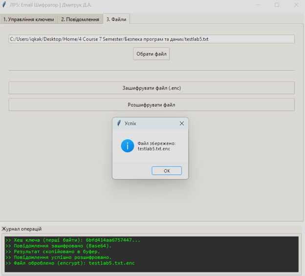

# Лабораторна робота №5: Захищена електронна пошта

## Опис

У цій папці розміщено вихідний код десктопного додатка для шифрування повідомлень та файлів. Програма реалізує власний алгоритм симетричного шифрування (XOR) з використанням ключів, згенерованих на основі персональних даних. Результат кодується в Base64 для зручної передачі через електронну пошту або месенджери.

Архітектура проєкту — монолітна (main.py) з використанням об'єктно-орієнтованого підходу (розділення на криптографічне ядро та графічний інтерфейс).

## Технічне завдання та Функціонал

Скрипт main.py реалізує інструментарій для захищеного листування:

* **Симетричне шифрування:** Реалізовано потоковий шифр на основі операції XOR.
* **Персоналізація ключів:** Генерація 256-бітного ключа відбувається шляхом хешування (SHA-256) ПІБ, дати народження та секретної фрази користувача.
* **Текстові повідомлення:**
    * Шифрування тексту в рядок Base64.
    * Дешифрування отриманих Base64-рядків у читабельний текст.
* **Робота з буфером обміну:** Швидке копіювання та вставка шифротексту для інтеграції з поштовими клієнтами.
* **Захист файлів:** Можливість шифрувати та розшифровувати файли будь-якого формату (вкладення).

## Технології

* **Мова:** Python 3.10+
* **Інтерфейс:** Tkinter (Стандартна графічна бібліотека)
* **Криптографія:** Hashlib (SHA-256), Base64 (Кодування)

## Запуск програми

1.  Переконайтесь, що у вас встановлено Python 3.x.
2.  Перейдіть до папки проєкту (lab05) у терміналі.
3.  Запустіть скрипт:
    ```bash
    python main.py
    ```

## Як користуватися

Робота з програмою поділена на три вкладки:

1.  **Управління ключем:**
    * Введіть свої персональні дані та секретну фразу.
    * Натисніть "Згенерувати ключ".
    * Можна також зберегти ключ у файл для передачі співрозмовнику.

2.  **Повідомлення:**
    * Введіть текст і натисніть "Зашифрувати" -> отримаєте Base64 код.
    * Вставте Base64 код і натисніть "Розшифрувати" -> отримаєте оригінальний текст.

3.  **Файли:**
    * Оберіть файл на диску.
    * Натисніть "Зашифрувати файл" (створиться .enc) або "Розшифрувати файл".

## Демонстрація роботи

### 1. Генерація ключа


### 2. Шифрування повідомлення


### 3. Дешифрування повідомлення


### 4. Робота з файлами
