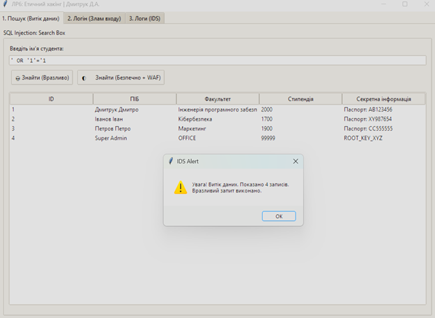
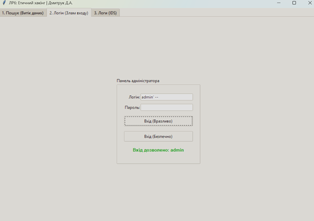
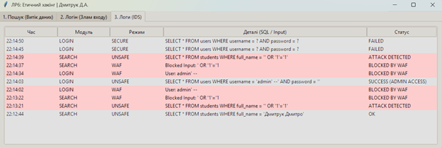

# Лабораторна робота №6: Етичний хакінг власного застосунку

## Опис

У цій папці розміщено вихідний код десктопного додатка, призначеного для демонстрації вразливостей типу SQL Injection та методів захисту від них. Програма емулює роботу з університетською базою даних, містить як вразливі до атак модулі, так і захищені версії коду.

Архітектура проєкту — монолітна (main.py) з логічним розділенням на рівень бази даних, рівень логіки безпеки та графічний інтерфейс.

## Технічне завдання та Функціонал

Скрипт main.py реалізує інструментарій для тестування безпеки та демонстрації атак:

* **Вразливі модулі:** Реалізація пошуку та авторизації через пряму конкатенацію рядків (f-strings), що робить систему вразливою до SQL-ін'єкцій.
* **Захищені модулі:** Реалізація аналогічного функціоналу з використанням параметризованих запитів (Prepared Statements), що унеможливлює ін'єкцію.
* **Web Application Firewall (WAF):** Модуль фільтрації вхідних даних, який шукає сигнатури атак (ключові слова UNION, OR, -- тощо).
* **Intrusion Detection System (IDS):** Система логування, що фіксує всі дії користувача, виявляє підозрілі запити та блокування WAF.
* **База даних:** Використання SQLite in-memory, яка автоматично наповнюється тестовими даними при запуску.

## Технології

* **Мова:** Python 3.x
* **Інтерфейс:** Tkinter (Стандартна графічна бібліотека)
* **База даних:** SQLite3
* **Додатково:** datetime (для логування подій)

## Запуск програми

1.  Переконайтесь, що у вас встановлено Python 3.x.
2.  Перейдіть до папки проєкту (lab06) у терміналі.
3.  Запустіть скрипт:
    ```bash
    python main.py
    ```

## Як користуватися

Робота з програмою поділена на три вкладки:

1.  **Пошук (Витік даних):**
    * Введіть ім'я або SQL-пейлоад (наприклад: ' OR '1'='1).
    * Натисніть "Знайти (Вразливо)" для демонстрації витоку даних.
    * Натисніть "Знайти (Безпечно)" для перевірки роботи захисту та WAF.

2.  **Логін (Злам входу):**
    * Введіть логін (наприклад: admin' --) та будь-який пароль.
    * Натисніть "Вхід (Вразливо)" для обходу авторизації.
    * Натисніть "Вхід (Безпечно)" для перевірки стійкості до атаки.

3.  **Логи (IDS):**
    * Переглядайте журнал подій.
    * Успішні атаки та блокування WAF підсвічуються для зручності аналізу.

## Демонстрація роботи

### 1. Демонстрація витоку даних (SQL Injection)


### 2. Обхід авторизації адміністратора


### 3. Робота системи захисту та логування (IDS)
