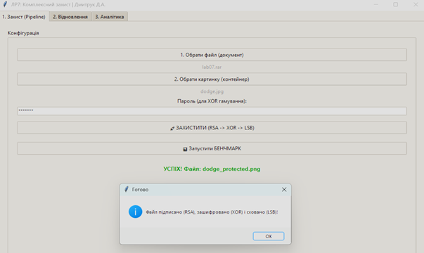
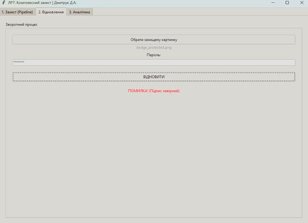
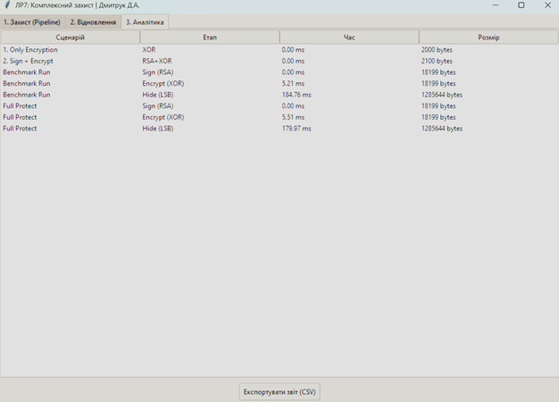

# Лабораторна робота №7: Комплексний захист особистого проекту

## Опис

У цій папці розміщено вихідний код десктопного додатка, призначеного для реалізації стратегії «Захист у глибину» (Defense in Depth). Програма об'єднує методи криптографії (забезпечення цілісності та конфіденційності) зі стеганографією (приховування факту передачі даних).

Архітектура проєкту — монолітна (`main.py`) з використанням об'єктно-орієнтованого підходу. Функціонал розділено на класи: менеджер ключів RSA, модуль потокового шифрування, стеганографічний рушій та графічний інтерфейс з аналітикою.

## Технічне завдання та Функціонал

Скрипт `main.py` реалізує автоматизований конвеєр (pipeline) захисту інформації:

* **Модуль цілісності (`RSAManager`):** Власна реалізація асиметричного алгоритму RSA (навчальна модель). Генерує пари ключів, створює та перевіряє цифровий підпис на основі хешу файлу, що гарантує захист від модифікації даних.
* **Модуль конфіденційності (`XORCipher`):** Потокове шифрування методом гамування. Ключова гама генерується псевдовипадковим чином на основі хешу від пароля користувача (KDF), перетворюючи дані на нечитабельний потік байтів.
* **Модуль приховування (`StegoLSB`):** Реалізація методу LSB (Least Significant Bit). Вбудовує зашифрований та підписаний пакет даних у піксельну сітку зображення-контейнера.
* **Аналітичний модуль:** Система бенчмаркінгу, яка заміряє час виконання кожного етапу (RSA, XOR, LSB) та зміну розміру даних, формуючи звіт про ефективність.
* **Інтерфейс:** GUI на базі Tkinter для зручного керування процесами захисту та відновлення.

## Технології

* **Мова:** Python 3.x
* **Інтерфейс:** Tkinter (Стандартна графічна бібліотека)
* **Обробка зображень:** Pillow (PIL)
* **Криптографія:** Hashlib, Random, Struct (вбудовані бібліотеки)

## Запуск програми

1.  Переконайтесь, що у вас встановлено Python 3.x.
2.  Встановіть необхідну бібліотеку для роботи із зображеннями:
    ```bash
    pip install Pillow
    ```
    *(або `pip install -r requirements.txt`, якщо ви створили цей файл)*
3.  Перейдіть до папки проєкту (`lab07`) у терміналі.
4.  Запустіть скрипт:
    ```bash
    python main.py
    ```

## Як користуватися

Робота з програмою поділена на три вкладки:

1.  **Захист (Pipeline):**
    * Оберіть файл, який потрібно захистити (документ, архів тощо).
    * Оберіть зображення-контейнер (`.png`, `.jpg`).
    * Введіть пароль (використовується для XOR-шифрування).
    * Натисніть **"ЗАХИСТИТИ"** для виконання повного циклу (Sign -> Encrypt -> Hide).
    * Натисніть **"Запустити БЕНЧМАРК"** для тестування швидкодії алгоритмів.

2.  **Відновлення:**
    * Оберіть захищене зображення (зазвичай має суфікс `_protected.png`).
    * Введіть пароль, який використовувався при захисті.
    * Натисніть **"ВІДНОВИТИ"**. Програма автоматично перевірить підпис RSA.
    * Якщо пароль невірний або файл пошкоджено, система видасть помилку цілісності.

3.  **Аналітика:**
    * Переглядайте результати бенчмарку (час виконання та обсяг даних по етапах).
    * Використовуйте кнопку **"Експортувати звіт (CSV)"** для збереження статистики у файл.

## Демонстрація роботи

### 1. Успішний захист файлу (Конвеєр RSA+XOR+LSB)


### 2. Реакція системи на атаку (Помилка підпису RSA)


### 3. Аналіз ефективності методів (Бенчмарк)
